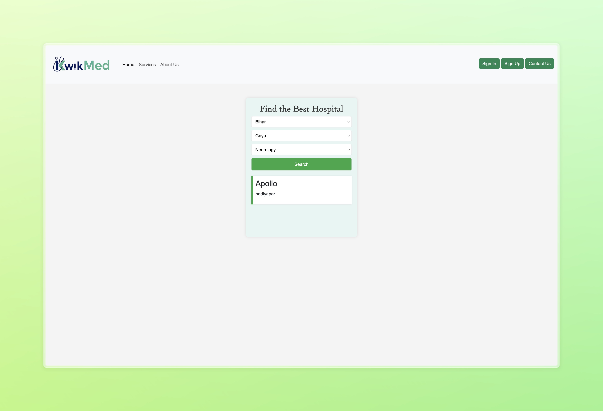

# KwikMed

  

  

  

  

Hospital Management Website
KwikMed is a modern healthcare platform designed to provide efficient and seamless medical services. Our goal is to simplify healthcare access by integrating technology with medical expertise, ensuring patients receive timely consultations, prescriptions, and healthcare assistance.

Online Appointment Booking – Schedule consultations with doctors instantly.

Telemedicine Support – Virtual consultations for remote healthcare access.

Electronic Health Records (EHR) – Securely store and manage medical history.

Prescription Management – Digital prescriptions with easy tracking.

User-Friendly Interface – Intuitive design for patients and doctors.

Secure & Compliant – Follows healthcare data privacy standards.
